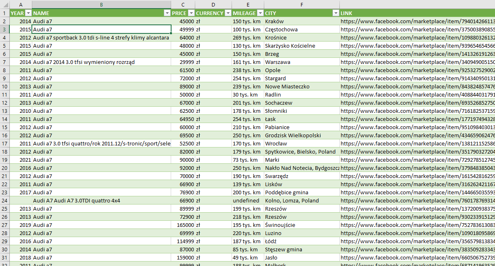

# Free marketplace scrapper

<p align="center">

</p>
<h3 align="center">An open-source chrome plugin to scrape Facebook Marketplace.
<h3 align="center">

```diff
You use the software provided at your own risk. I cannot be held responsible for any potential consequences, including potential bans from Meta.
```

### Overview

This open-source chrome plugin uses Javascript to scrape data from Facebook Marketplace.
Browser plugin enabling easy filtering of interesting offers. After filtering, the results are saved as a CSV file in the Downloads folder, which can be easily opened in Excel.

### Install and run

Here's the detailed description of the installation and usage process:

1. Download the code of the program from the appropriate source.
2. In Chrome, go to the "Manage Extensions" section, which you can find in the browser's settings menu. Then click on the "Load unpacked" button and select the folder where you downloaded the program's code.
3. Go to the Facebook Marketplace and adjust the filters that interest you.
4. Open the installed plugin and wait for the settings to initialize.
5. Enter the keywords that should be included in the title of the offer, separated by commas, and then click the "Let's go" button.
6. Wait for the filtering process to complete or click the "Stop" button if you want to interrupt the filtering.
7. The CSV file will be automatically downloaded to your computer.
8. Open Excel and load the CSV file by selecting "Data" -> "From text/CSV" -> "File origin" (Unicode UTF-8) -> "Load".

That's it! Now you can easily use the program to filter and analyze offers according to your preferences.

<div style="display: flex">
<div></div>
<div style="margin-left: 10px">And if you find this tool helpful, consider supporting us through <a href="https://www.buymeacoffee.com/mbohdan" target="_blank">Buy me a coffee</a>. Your contribution helps us maintain and improve this plugin for you!</div>
</div>
<br>

<p align="center">

</p>
